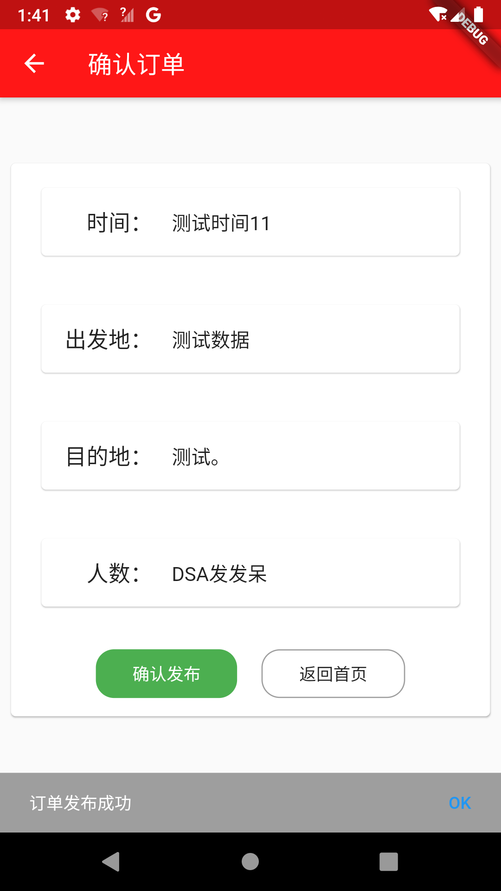
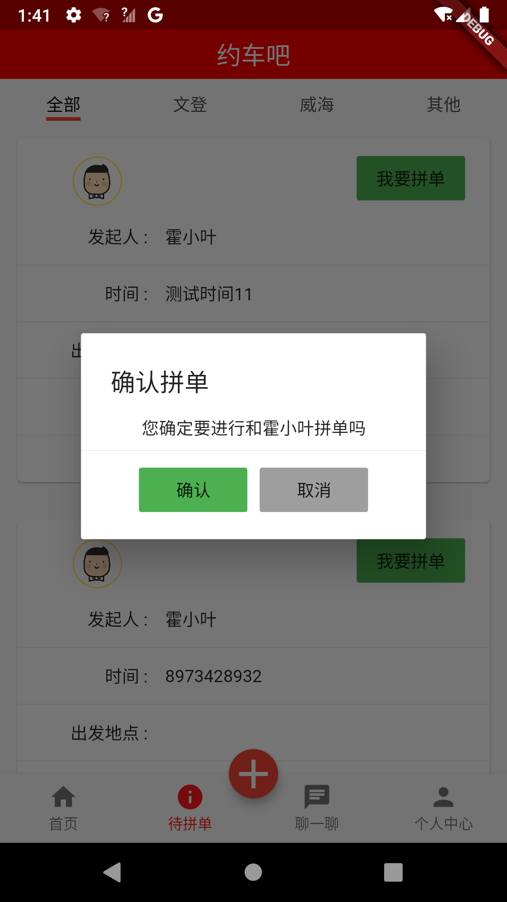

# 我爱电子商务 我爱雄总 
> design by huoxiaoye

> 因为时间,后端部分只完成了两个接口.保存新的订单和将订单返回给flutter.

> 该项目告一段落-----

> 欢迎issue star

> 霍小叶 继续加油呀.

### A flutter App
> if you hava a flutter environment please clone and done
* flutter run

### screenshot

